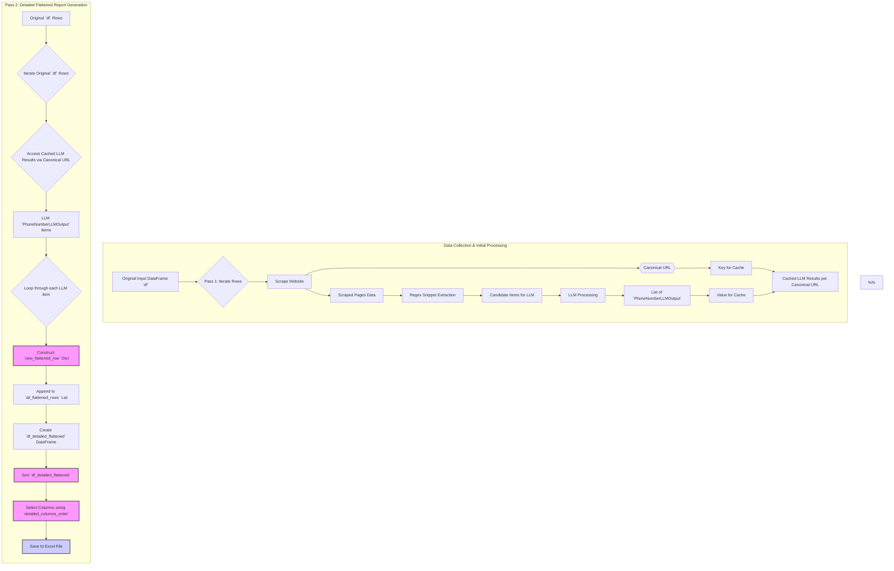

# Plan: Update Flattened Excel Report Columns

**Date:** 2025-05-20
**Version:** 1.0

## Objective

Revise the structure of the detailed flattened Excel report (`phone_validation_detailed_output_{run_id}.xlsx`) to include only the specified columns in the correct order, and use the date/time-based `run_id`.

## Files to be Modified

1.  `main_pipeline.py`

## Detailed Plan

### 1. Update `detailed_columns_order` in `main_pipeline.py`

*   Locate the `detailed_columns_order` list (currently around line 394 in `main_pipeline.py`).
*   Replace its current content with the new required column order:
    ```python
    detailed_columns_order = [
        'CanonicalEntryURL',
        'Number',
        'LLM_Type',
        'LLM_Classification',
        'LLM_Source_URL',
        'ScrapingStatus',
        'TargetCountryCodes',
        'RunID'
    ]
    ```

### 2. Modify `new_flattened_row` Dictionary Construction in `main_pipeline.py`

*   Locate the section where `new_flattened_row` is created (currently around lines 441-453 in `main_pipeline.py`).
*   Adjust the keys and values to match the new column names and data sources:
    *   Change `'Canonical_URL': canonical_url_pass2` to `'CanonicalEntryURL': canonical_url_pass2`.
    *   Change `'LLM_Number': llm_item_final.number` to `'Number': llm_item_final.number`.
    *   The keys `'LLM_Type'`, `'LLM_Classification'`, `'LLM_Source_URL'`, `'ScrapingStatus'`, and `'TargetCountryCodes'` and their current value assignments are correct and align with the new column names.
    *   Change `'RunID': original_row_data.get('RunID')` to `'RunID': run_id`. (The `run_id` variable, which holds the date/time-based ID, is defined at the beginning of the `main()` function and is accessible in this scope).
    *   Remove `'CompanyName': company_name_pass2` and `'GivenURL': given_url_pass2` as they are not in the new required list of columns for this specific report.

The updated `new_flattened_row` construction will look like this:
```python
                    new_flattened_row: Dict[str, Any] = {
                        'CanonicalEntryURL': canonical_url_pass2,
                        'Number': llm_item_final.number,
                        'LLM_Type': llm_item_final.type,
                        'LLM_Classification': llm_item_final.classification,
                        'LLM_Source_URL': llm_item_final.source_url,
                        'ScrapingStatus': canonical_site_scraper_status.get(canonical_url_pass2, scraper_status_pass2),
                        'TargetCountryCodes': original_row_data.get('TargetCountryCodes'),
                        'RunID': run_id # Uses the date/time-based run_id
                    }
```

### 3. Adjust DataFrame Sorting in `main_pipeline.py`

*   Locate the `df_detailed_flattened.sort_values(...)` call (currently around line 559 in `main_pipeline.py`).
*   Update the `by` parameter to use the new column names and remove columns that will no longer exist in `df_detailed_flattened` (like `CompanyName`).
*   The current sort is: `by=['CompanyName', 'Canonical_URL', 'LLM_Classification_Sort', 'LLM_Number']`
*   The new sort will be: `by=['CanonicalEntryURL', 'LLM_Classification_Sort', 'Number']`
    (The `LLM_Classification_Sort` temporary column is derived from `LLM_Classification` and can remain as is for sorting purposes before being dropped).

## Visual Representation of Changes



**Notes for Mermaid Diagram in Markdown:**

The `new_flattened_row` dictionary will now contain:
*   `CanonicalEntryURL` (from `canonical_url_pass2`)
*   `Number` (from `llm_item_final.number`)
*   `LLM_Type` (from `llm_item_final.type`)
*   `LLM_Classification` (from `llm_item_final.classification`)
*   `LLM_Source_URL` (from `llm_item_final.source_url`)
*   `ScrapingStatus` (from `canonical_site_scraper_status` or `scraper_status_pass2`)
*   `TargetCountryCodes` (from `original_row_data`)
*   `RunID` (from date/time `run_id` variable)

The `detailed_columns_order` list will be:
`['CanonicalEntryURL', 'Number', 'LLM_Type', 'LLM_Classification', 'LLM_Source_URL', 'ScrapingStatus', 'TargetCountryCodes', 'RunID']`

## Summary of Changes

The core changes involve:
1.  Updating the `detailed_columns_order` list to exactly match your specified columns and order.
2.  Modifying the creation of the `new_flattened_row` dictionary to:
    *   Use the date/time-based `run_id`.
    *   Rename keys like `Canonical_URL` to `CanonicalEntryURL` and `LLM_Number` to `Number` to match the new `detailed_columns_order`.
    *   Remove fields not present in the new `detailed_columns_order` (e.g., `CompanyName`, `GivenURL`).
3.  Adjusting the sorting logic to use the new column names.

This plan ensures that the "flattened phone number Excel file" will contain precisely the columns you've requested, in the specified order, and with the correct Run ID.