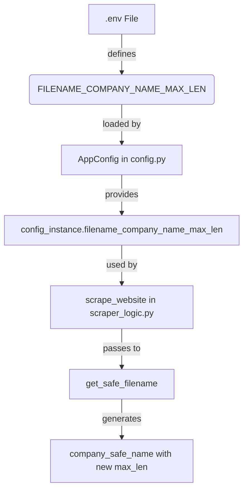

# Plan to Address Scraper Filename Length Issues

**Goal:** Implement a configurable maximum length for the company name part of filenames to prevent path length errors, and provide guidance for setting this configuration. This will make the scraper more robust across different operating systems and file path lengths.

**Background:**
The pipeline was encountering `IOError: [Errno 2] No such file or directory` when saving scraped content. This was diagnosed as an issue where the total path length, including the generated filename, exceeded the operating system's maximum path length (e.g., MAX_PATH on Windows, typically around 260 characters). The long company names were a primary contributor to this.

**Plan Details:**

1.  **Add New Configuration to `AppConfig`:**
    *   **File:** `phone_validation_pipeline/src/core/config.py`
    *   **Action:** Introduce a new integer configuration option `filename_company_name_max_len`. This will be loaded from an environment variable `FILENAME_COMPANY_NAME_MAX_LEN`. A default value (e.g., 25) will be set if the environment variable is not present.
    *   **Code Snippet (to be added in `AppConfig.__init__`):**
        ```python
        self.filename_company_name_max_len: int = int(os.getenv('FILENAME_COMPANY_NAME_MAX_LEN', '25'))
        ```

2.  **Update Scraper Logic to Use New Configuration:**
    *   **File:** `phone_validation_pipeline/src/scraper/scraper_logic.py`
    *   **Action:** In the `scrape_website` function, modify the call to `get_safe_filename` that generates `company_safe_name`. Instead of a hardcoded `max_len`, it will now use `config_instance.filename_company_name_max_len`.
    *   **Code Snippet (modification in `scrape_website` function, around line 450):**
        ```python
        # Before
        # company_safe_name = get_safe_filename(company_name_or_id, for_url=False, max_len=50)

        # After
        company_safe_name = get_safe_filename(
            company_name_or_id,
            for_url=False,
            max_len=config_instance.filename_company_name_max_len # Use the new config value
        )
        ```

3.  **Update `.env.example` with Guidance:**
    *   **File:** `phone_validation_pipeline/.env.example`
    *   **Action:** Add the new `FILENAME_COMPANY_NAME_MAX_LEN` environment variable to the example file. Include a detailed comment explaining its purpose, how it affects filenames, and provide guidance on how to choose an appropriate value by calculating the approximate fixed path length of the output directory structure.
    *   **Example Content for `.env.example`:**
        ```dotenv
        # --- Filename Configuration ---
        # FILENAME_COMPANY_NAME_MAX_LEN=25
        # Sets the maximum length for the sanitized company name part of the output filenames.
        # To avoid path length errors (especially on Windows, max path ~260 chars),
        # consider your project's root path length and the fixed output subdirectories.
        # Example Calculation for Windows (target total path < 255):
        #   Typical Project Root: C:\Users\YourUser\Projects\MyProject (e.g., 40 chars)
        #   Pipeline Output Base: phone_validation_pipeline/ (e.g., 26 chars, if running from MyProject)
        #   Configured output_base_dir: output_data/ (12 chars)
        #   Timestamped Run Folder: 20240101_120000/ (16 chars)
        #   Fixed Subfolders: scraped_content/cleaned_pages_text/ (30 chars)
        #   URL Hash Part of Filename: __domainpart_hash_cleaned.txt (approx. 35 chars)
        #   Separators (slashes): approx. 7 chars
        #   --------------------------------------------------------------------
        #   Total Fixed Length (approx): 40 + 26 + 12 + 16 + 30 + 35 + 7 = 166 chars
        #   Remaining Budget for Company Name: 255 - 166 = 89 chars.
        #   A FILENAME_COMPANY_NAME_MAX_LEN around 20-30 should be very safe if your root path is longer,
        #   or up to 50-80 if your root path is short. Adjust based on your actual root path.
        ```

**Mermaid Diagram of Configuration Flow:**



This plan aims to resolve the `IOError` related to path lengths by making the filename generation more adaptable to different environments.