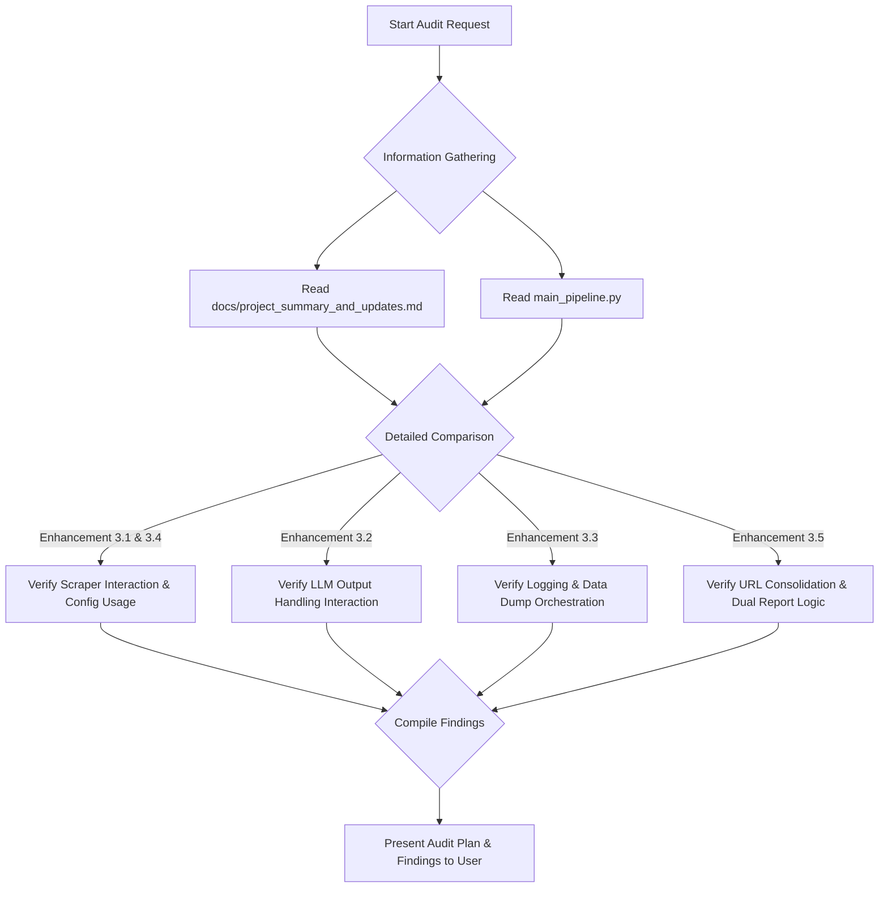

# Pipeline Audit and LLM Prompt Enhancement Plan

**Date:** 2025-05-20

## 1. Audit of `main_pipeline.py` vs. `project_summary_and_updates.md`

### 1.1. Objective

To audit the `main_pipeline.py` file against the `docs/project_summary_and_updates.md` to ensure the pipeline incorporates all recent updates and functions as described in the summary.

### 1.2. Audit Plan

The audit was structured to systematically compare the "Recent Major Enhancements" detailed in the project summary with their implementation or orchestration within `main_pipeline.py`.



**Detailed Steps of the Plan:**

1.  **Information Gathering:**
    *   Read and understood the `docs/project_summary_and_updates.md` document, focusing on section "3. Summary of Recent Major Enhancements."
    *   Read and analyzed the entire `main_pipeline.py` script.
2.  **Comparative Analysis:**
    For each major enhancement listed in the summary, `main_pipeline.py` was examined to verify its role in orchestrating or interacting with the described functionalities.

### 1.3. Audit Findings

Overall, `main_pipeline.py` appears to be **well-aligned** with the enhancements described in `docs/project_summary_and_updates.md`. The script correctly orchestrates the new features and reflects the architectural changes.

**Breakdown by Enhancement:**

1.  **Advanced Scraper Link Prioritization & Control (Summary 3.1) & Configurable Scraper Filename Lengths (Summary 3.4):**
    *   `main_pipeline.py` correctly calls the `scrape_website` function.
    *   Configurations are appropriately handled by `src/core/config.py` and utilized by `src/scraper/scraper_logic.py`, with `main_pipeline.py` acting as an orchestrator.

2.  **LLM Output Handling Modification (Summary 3.2):**
    *   `main_pipeline.py` initializes `GeminiLLMExtractor` and receives structured `PhoneNumberLLMOutput` objects, aligning with `src/llm_extractor_component.py` handling the parsing of plain text from the LLM.
    *   Saving of `llm_raw_response` by `main_pipeline.py` supports this.

3.  **Enhanced Logging & Dedicated Data Dumps (Summary 3.3):**
    *   **Run-Specific Log File:** Correctly implemented.
    *   **Configurable Log Levels:** Correctly read from `app_config` and applied.
    *   **Dedicated File Dumps:**
        *   `intermediate_data_dir` and `llm_context_dir` are created.
        *   Regex-extracted snippets are saved as described.
        *   LLM context files (`CANONICAL_{...}_llm_input.json` for candidate items and `CANONICAL_{...}_llm_raw_output.json` for raw LLM response) are correctly saved by `main_pipeline.py`. (Note: This section leads into the enhancement plan below regarding the full prompt text).
    *   **Narrative Logging:** The script contains numerous informative log messages.

4.  **URL Consolidation & Dual Excel Reports (Summary 3.5):**
    *   This major architectural change is well-implemented in `main_pipeline.py`.
    *   Canonical URL handling, global caches (`canonical_site_llm_results`, `canonical_site_scraper_status`, `input_to_canonical_map`), two-pass processing, and generation of the two specified Excel reports are all present and align with the summary.

### 1.4. Conclusion of Audit

`main_pipeline.py` effectively implements and orchestrates the recent major enhancements outlined in the project summary. The code structure supports the described new functionalities, data flows, and output requirements. The primary area identified for further refinement was the exact nature of the "Full LLM Prompt Input" file, which is addressed in the enhancement plan below.

## 2. Enhancement Plan for LLM Prompt Input Saving

### 2.1. Objective/Requirement Clarification

The goal is to have two distinct files related to LLM input for better clarity and debugging:
1.  A file containing just the **input data/snippets** (the variable part that's fed into the prompt template).
2.  A separate file containing the **full, final prompt string** (the template combined with the input data) that is actually sent to the LLM.

This addresses the point from the summary about saving the "Full LLM Prompt Input" more explicitly.

### 2.2. Proposed File Structure for LLM Context

*   **`run_output_dir/llm_context/CANONICAL_{safe_canonical_name}_llm_input_data.json`**: This file will store the structured candidate items (the "inputted data") that are passed to the LLM component.
*   **`run_output_dir/llm_context/CANONICAL_{safe_canonical_name}_llm_full_prompt.txt`**: This new file will store the complete, final text string that is constructed and sent to the LLM API.
*   **`run_output_dir/llm_context/CANONICAL_{safe_canonical_name}_llm_raw_output.json`**: This will remain as is, storing the raw response from the LLM.

### 2.3. Detailed Plan for Implementation

**1. Modify `GeminiLLMExtractor.extract_phone_numbers` method in `src/llm_extractor_component.py`:**

*   **Update Method Signature:**
    *   Change from:
        ```python
        def extract_phone_numbers(
            self,
            candidate_items: List[Dict[str, str]],
            prompt_template_path: str
        ) -> Tuple[List[PhoneNumberLLMOutput], Optional[str]]:
        ```
    *   To:
        ```python
        def extract_phone_numbers(
            self,
            candidate_items: List[Dict[str, str]],
            prompt_template_path: str,
            llm_context_dir: str,  # New parameter
            file_identifier_prefix: str  # New parameter
        ) -> Tuple[List[PhoneNumberLLMOutput], Optional[str]]:
        ```

*   **Save the Full Prompt:**
    *   After `formatted_prompt` is created (around line 208), add:
        ```python
        # (Ensure 'import os' is at the top of the file)
        try:
            full_prompt_filename = f"{file_identifier_prefix}_llm_full_prompt.txt"
            full_prompt_filepath = os.path.join(llm_context_dir, full_prompt_filename)
            with open(full_prompt_filepath, 'w', encoding='utf-8') as f_prompt:
                f_prompt.write(formatted_prompt)
            logger.info(f"Saved full LLM prompt to {full_prompt_filepath}")
        except IOError as e:
            logger.error(f"IOError saving full LLM prompt to {full_prompt_filepath}: {e}")
        ```

**2. Update `main_pipeline.py`:**

*   **Modify Call to `extract_phone_numbers`:**
    *   Around line 326, change the call to pass the new arguments:
        ```python
        llm_classified_outputs, llm_raw_response = llm_extractor.extract_phone_numbers(
            candidate_items=all_candidate_items_for_llm,
            prompt_template_path=prompt_template_abs_path,
            llm_context_dir=llm_context_dir, # Pass existing variable
            file_identifier_prefix=f"CANONICAL_{safe_canonical_name_for_file}" # Construct prefix
        )
        ```

*   **Rename LLM Input Data File:**
    *   Change line 319 from:
        `llm_input_filename = f"CANONICAL_{safe_canonical_name_for_file}_llm_input.json"`
    *   To:
        `llm_input_filename = f"CANONICAL_{safe_canonical_name_for_file}_llm_input_data.json"`
    *   Update the corresponding log message on line 323.

**3. Update Documentation (`docs/project_summary_and_updates.md`):**

*   Modify the "Dedicated File Dumps for Key Intermediate Data" section (around lines 76-80) to:
    > *   **LLM Input Data:** The structured candidate items (JSON) fed into the LLM prompt template are saved to `run_output_dir/llm_context/CANONICAL_{...}_llm_input_data.json`.
    > *   **Full LLM Prompt Text:** The complete, final text prompt sent to the LLM is saved to `run_output_dir/llm_context/CANONICAL_{...}_llm_full_prompt.txt`.

### 2.4. Sequence Diagram for LLM Prompt Saving

```mermaid
sequenceDiagram
    participant M as main_pipeline.py
    participant L as llm_extractor_component.py

    M->>M: Define llm_context_dir
    M->>M: Define safe_canonical_name_for_file
    M->>M: Save candidate_items to ..._llm_input_data.json

    M->>L: extract_phone_numbers(candidate_items, template_path, llm_context_dir, file_identifier_prefix)
    L->>L: Load prompt_template
    L->>L: Create candidate_items_json_str
    L->>L: Create formatted_prompt (template + candidate_items_json_str)
    L->>L: Save formatted_prompt to llm_context_dir / file_identifier_prefix_llm_full_prompt.txt
    L->>L: Send formatted_prompt to Gemini API
    L->>L: Receive raw_llm_response
    L->>M: Return (parsed_numbers, raw_llm_response)

    M->>M: Save raw_llm_response to ..._llm_raw_output.json